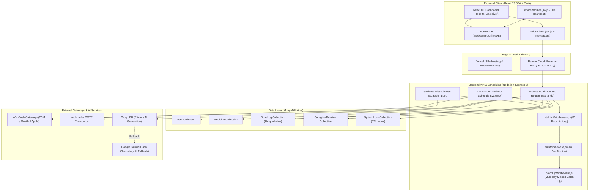
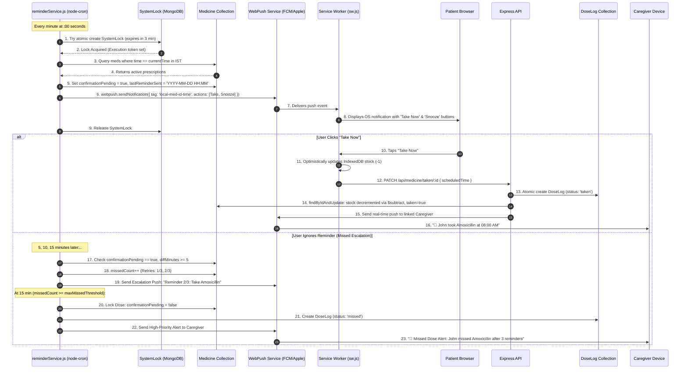
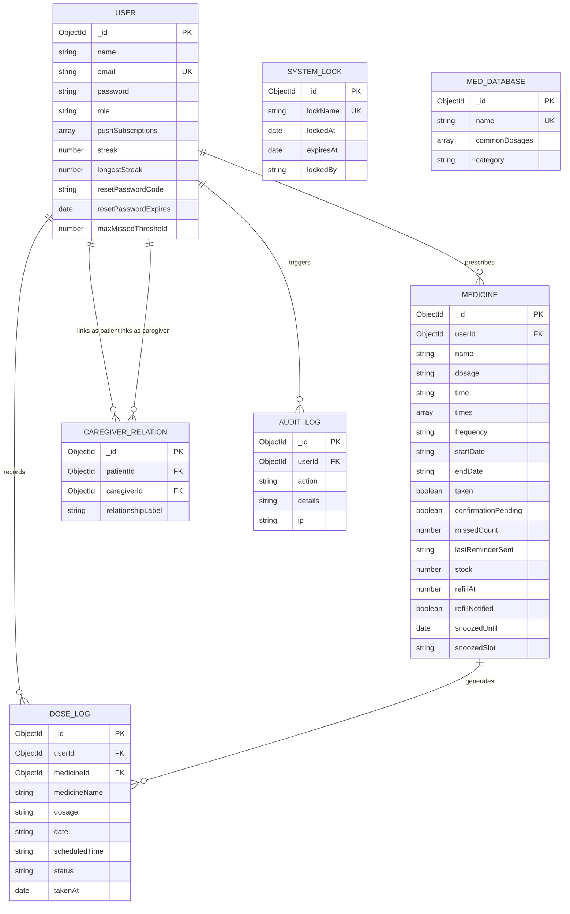

# 🩺 MedRemind — Complete Technical Implementation & Architecture Guide
### AI-Assisted Caregiver Medicine Reminder System (MERN Stack)

---

## 📑 Table of Contents
1. [Executive Summary & High-Level Overview](#1-executive-summary--high-level-overview)
2. [Complete System Architecture & Flow Diagrams](#2-complete-system-architecture--flow-diagrams)
3. [Technology Stack & In-Depth Trade-Off Analysis](#3-technology-stack--in-depth-trade-off-analysis)
4. [Repository Structure & File Responsibilities](#4-repository-structure--file-responsibilities)
5. [Database Architecture & Schema Modeling](#5-database-architecture--schema-modeling)
6. [Core Engine 1: Dual-Layer Reminder & Scheduling Engine](#6-core-engine-1-dual-layer-reminder--scheduling-engine)
7. [Core Engine 2: Missed Dose Escalation & Caregiver Alerting](#7-core-engine-2-missed-dose-escalation--caregiver-alerting)
8. [Core Engine 3: Offline-First PWA & Service Worker Heartbeat](#8-core-engine-3-offline-first-pwa--service-worker-heartbeat)
9. [Core Engine 4: Deterministic Analytics & Clinical Reports](#9-core-engine-4-deterministic-analytics--clinical-reports)
10. [Core Engine 5: Generative AI Interpretation Pipeline](#10-core-engine-5-generative-ai-interpretation-pipeline)
11. [Authentication, Cryptography & Security Hardening](#11-authentication-cryptography--security-hardening)
12. [End-to-End User Journeys (Step-by-Step Traces)](#12-end-to-end-user-journeys-step-by-step-traces)
13. [Complete REST API Endpoint Map](#13-complete-rest-api-endpoint-map)
14. [Deployment, Infrastructure & Production Topology](#14-deployment-infrastructure--production-topology)
15. [Master Technical Interview Preparation & Defense](#15-master-technical-interview-preparation--defense)

---

## 1. Executive Summary & High-Level Overview

**MedRemind** is an enterprise-grade clinical medication adherence and caregiver monitoring platform built on the **MERN (MongoDB, Express.js, React, Node.js)** stack. 

### The Problem It Solves
Medication non-adherence is one of the leading causes of preventable medical complications globally. Patients forget doses, lose track of multi-dose daily schedules, run out of pill supplies unexpectedly, and lack a reliable safety net when living independently. Standard alarm clock apps fail because:
- They are easily swiped away without accountability.
- They do not track inventory or calculate therapeutic adherence streaks.
- They cannot alert remote family caregivers when critical doses are missed.

### The MedRemind Solution
MedRemind creates a closed-loop adherence ecosystem:
1. **Dual-Layer Alarms:** Combines server-side WebPush notifications with an offline-first Service Worker heartbeat in Indian Standard Time (`Asia/Kolkata`, UTC+5:30).
2. **Deterministic Adherence Analytics:** Calculates mathematically exact compliance percentages and 365-day streaks in backend Node.js.
3. **Automated Missed Dose Escalation:** Re-alerts patients every 5 minutes and automatically escalates unconfirmed doses to family caregivers after a configurable threshold.
4. **AI Clinical Insights:** Privacy-sanitized adherence metrics are passed to an LLM interpretation layer (Groq LPU with Google Gemini fallback) that produces empathetic, structured clinical observations.
5. **Fault-Tolerant Offline Sync:** PWA Service Worker with IndexedDB caching ensures alarms fire and doses can be logged even in airplane mode.

---

## 2. Complete System Architecture & Flow Diagrams

### 2.1 High-Level Architecture Diagram



---

### 2.2 Sequence Diagram: Medication Reminder & Dose Confirmation



---

## 3. Technology Stack & In-Depth Trade-Off Analysis

| Layer | Technology Selected | Why It Was Chosen | Alternatives Considered | Engineering Trade-offs & Rationale |
| :--- | :--- | :--- | :--- | :--- |
| **Frontend Framework** | **React 19** | Declarative component model, virtual DOM diffing for rapid UI state updates, and standard hooks architecture | Vue.js, Angular, Svelte | React’s widespread ecosystem enables seamless integration with React Router 7, Service Worker event buses, and custom lightweight SVG charting without heavy third-party dependencies. |
| **Routing** | **React Router 7** | Client-side SPA routing with lazy-loaded chunk splitting via `React.lazy()` and `<Suspense>` | Next.js App Router | MedRemind is designed as a standalone authenticated Progressive Web App (PWA) with extensive offline Service Worker integration. Next.js SSR adds unnecessary Node server overhead for a client-side offline-first tool. |
| **Backend Framework** | **Node.js + Express 5** | Non-blocking asynchronous I/O ideal for high-throughput background cron jobs, WebPush fan-outs, and lightweight REST endpoints | Python FastAPI, Go, Django | Single-language full-stack JavaScript allows sharing validation regex, date formatting routines, and JSON data contracts between frontend and backend. |
| **Database** | **MongoDB Atlas + Mongoose 9** | Flexible schema structure supporting nested arrays (e.g. `times`, `pushSubscriptions`), atomic array operators (`$push`, `$pull`), and native TTL indexes | PostgreSQL, MySQL | Medical schedules have polymorphic properties (variable daily times, optional end dates, multi-device push endpoints). MongoDB handles these nested document structures natively without requiring 6+ relational joins. |
| **Job Scheduling** | **Node-cron (In-Process)** | Zero-dependency, lightweight 1-minute cron scheduling running directly inside the Node server process | BullMQ / Redis Queue, Agenda | BullMQ requires maintaining a separate Redis server instance and worker processes. For MedRemind's scale, `node-cron` combined with our MongoDB `SystemLock` provides distributed multi-instance locking without added Redis infrastructure costs. |
| **Push Delivery** | **WebPush (RFC 8292 / VAPID)** | Wakes sleeping mobile and desktop OS devices natively even when the browser window or app is completely closed | WebSockets (Socket.io) | WebSockets require an active, open TCP connection. Mobile operating systems (Android/iOS) kill background socket connections within seconds of screen lock to conserve battery. WebPush utilizes native OS notification daemons (Google FCM, Apple APNs) with high delivery reliability. |
| **Email Transporter** | **Nodemailer (SMTP)** | RFC-compliant email delivery supporting custom SMTP, Gmail services, and Ethereal test mailboxes | SendGrid API, Resend | Nodemailer allows complete configuration flexibility across private clinical SMTP servers, cloud relays, or local developer test accounts without vendor lock-in. |
| **AI Inference** | **Groq LPU (Primary) + Google Gemini (Secondary)** | Groq provides sub-400ms JSON inference speeds. Google Gemini Flash provides reliable cloud fallback | Self-hosted Ollama, OpenAI GPT-4o | Groq's specialized Language Processing Units (LPUs) provide near-instant responses, preventing frontend UI timeouts. Combining Groq with Gemini guarantees 99.9% AI availability. |
| **Analytics Engine** | **Deterministic Node.js Backend** | Pure mathematical precision for adherence percentages and consecutive streaks | LLM-based calculations | LLMs are non-deterministic and can hallucinate numerical calculations. In healthcare software, compliance numbers and streaks must be 100% mathematically exact. |

---

## 4. Repository Structure & File Responsibilities

```text
medremind-mern/
├── backend/
│   ├── config/
│   │   └── db.js                              # MongoDB connection lifecycle with event hooks
│   ├── controllers/
│   │   ├── adminController.js                 # Admin user metrics, audit logs, MedDB, push broadcast
│   │   ├── aiController.js                    # AI Report Insights & Caregiver Summary endpoints
│   │   ├── authController.js                  # Register, login, profile, cascade account deletion, OTP reset
│   │   ├── caregiverController.js             # Patient-caregiver linking, RBAC validation, patient dashboards
│   │   └── medicineController.js              # Prescription CRUD, atomic markTaken, snooze, stock, reports, logs
│   ├── middleware/
│   │   ├── authMiddleware.js                  # JWT verification & Bearer token decoding
│   │   ├── catchUpMiddleware.js               # Passive multi-day missed dose synchronization
│   │   └── rateLimitMiddleware.js             # In-memory IP rate limiter (express-rate-limit)
│   ├── models/
│   │   ├── AuditLog.js                        # Clinical & administrative audit log records
│   │   ├── CaregiverRelation.js               # Relational link between Patient and Caregiver with compound index
│   │   ├── DoseLog.js                         # Immutable clinical dose logs with compound unique index
│   │   ├── MedDatabase.js                     # Standard medication dictionary and common dosages
│   │   ├── Medicine.js                        # Patient prescription schedules, stock, and status flags
│   │   ├── SystemLock.js                      # MongoDB TTL-based distributed concurrency lock
│   │   └── User.js                            # User accounts, bcrypt passwords, multi-device VAPID subscriptions
│   ├── routes/
│   │   ├── adminRoutes.js                     # Protected /api/admin routes
│   │   ├── aiRoutes.js                        # Protected /api/ai routes
│   │   ├── authRoutes.js                      # /api/auth routes (login, register, forgot-password, profile)
│   │   ├── caregiverRoutes.js                 # Protected /api/caregiver routes
│   │   └── medicineRoutes.js                  # Protected /api/medicine routes
│   ├── services/
│   │   ├── aiReportService.js                 # Groq & Gemini multi-model cascade, payload sanitization, caching
│   │   ├── pushService.js                     # VAPID WebPush dispatcher, multi-device fan-out, 410 pruning
│   │   ├── reminderService.js                 # 1-min node-cron scheduler, IST timezone parser, missed escalation
│   │   └── reportMetricsService.js            # Deterministic adherence % and 365-day streak calculation
│   ├── server.js                              # Express app bootstrap, trust proxy, CORS, security headers
│   └── package.json                           # Backend dependencies
│
├── frontend/
│   ├── public/
│   │   ├── index.html                         # SPA mount point
│   │   ├── manifest.json                      # Web App Manifest (PWA configuration)
│   │   ├── medremind-icon-192.svg / 512.svg   # High-resolution vector icons
│   │   └── sw.js                              # Service Worker: offline alarm heartbeat, action clicks, offline queue
│   ├── src/
│   │   ├── components/
│   │   │   ├── UI/                            # Reusable UI primitives: Badge, Button, Card, Input, ProgressBar
│   │   │   ├── AppShell.js                    # Standard authenticated page wrapper with header & sidebar
│   │   │   ├── DailyProgress.js               # Dynamic SVG circular progress ring for today's doses
│   │   │   ├── ErrorBoundary.js               # React class component catching uncaught UI errors
│   │   │   ├── Header.js                      # Top bar with user profile, streak badge, notification bell
│   │   │   ├── LoadingSpinner.js              # Smooth CSS loading indicator
│   │   │   ├── MedicineList.js                # Medicine schedule cards with interactive Take/Snooze actions
│   │   │   ├── Navbar.js                      # Responsive navigation bar
│   │   │   ├── QuickActions.js                # Shortcut buttons for quick navigation
│   │   │   ├── Sidebar.js                     # Collapsible side drawer
│   │   │   ├── Skeleton.js                    # Zero-flicker placeholder skeleton screens
│   │   │   └── Toast.js                       # React Context-based toast notification provider
│   │   ├── pages/
│   │   │   ├── AddMedicinePage.js             # Prescription schedule creation wizard
│   │   │   ├── Admin.js                       # Admin management panel
│   │   │   ├── CalendarView.js                # Monthly adherence calendar & daily dose breakdown
│   │   │   ├── CaregiverDashboard.js          # Remote caregiver patient monitoring & AI clinical summaries
│   │   │   ├── CaregiverLinking.js            # Patient $\leftrightarrow$ Caregiver linking interface
│   │   │   ├── Dashboard.js                   # Main user dashboard with today's schedule & progress ring
│   │   │   ├── ForgotPassword.js              # 2-step OTP email password reset
│   │   │   ├── HistoryLog.js                  # Filterable timeline of taken and missed dose logs
│   │   │   ├── Login.js                       # User authentication screen (email or username)
│   │   │   ├── NotFound.js                    # 404 error page
│   │   │   ├── Profile.js                     # User profile, password management, missed dose threshold setting
│   │   │   ├── RefillTracker.js               # Medication stock tracker and refill threshold alerts
│   │   │   ├── Register.js                    # User registration screen
│   │   │   └── Reports.js                     # Adherence charts & on-demand AI Report Insights
│   │   ├── services/
│   │   │   ├── api.js                         # Axios client, baseURL resolution, request/response interceptors
│   │   │   ├── notifications.js               # WebPush permission requester and subscription manager
│   │   │   └── offlineSync.js                 # IndexedDB bridge, Service Worker message bus, offline queue sync
│   │   ├── styles/                            # CSS Design System (variables, components, responsive layouts)
│   │   ├── App.js                             # React Router configuration, lazy loading, SessionGuard
│   │   └── index.js                           # React 19 root DOM render
│   ├── package.json                           # Frontend dependencies
│   └── vercel.json                            # Vercel SPA routing rules
```

---

## 5. Database Architecture & Schema Modeling

MedRemind utilizes **7 dedicated Mongoose schemas** in MongoDB Atlas designed for data consistency, query performance, and concurrency protection.



### 5.1 Schema Design Details & Index Optimization

#### 1. `User` Schema ([`User.js`](file:///c:/Users/DELL/Downloads/medremind-mern/backend/models/User.js))
- **Email Index:** `{ email: 1 }` (`unique: true, lowercase: true, trim: true`). Prevents duplicate accounts across variations in casing or whitespace.
- **Multi-Device Push:** `pushSubscriptions` array stores `{ endpoint, keys: { p256dh, auth }, userAgent, updatedAt }`, allowing users to receive notifications across multiple phones and laptops simultaneously.
- **Hashed Reset OTP:** `resetPasswordCode` stores a `bcrypt` hash (12 salt rounds) of the 6-digit verification code, ensuring plaintext OTPs are never exposed in database backups.

#### 2. `Medicine` Schema ([`Medicine.js`](file:///c:/Users/DELL/Downloads/medremind-mern/backend/models/Medicine.js))
- **Times Array:** Supports multi-dose daily regimens (e.g. `times: ["08:00", "14:00", "20:00"]`).
- **Status Flags:** `confirmationPending` signals an active alarm awaiting user response; `taken` indicates all scheduled doses for the current day are complete.
- **Composite Indexes:**
  - `{ userId: 1, lastResetDate: 1 }`: Optimizes daily reset and catch-up queries.
  - `{ confirmationPending: 1, taken: 1 }`: Optimizes the 5-minute missed escalation cron scanner.
  - `{ refillNotified: 1 }`: Speeds up real-time low-stock inventory checks.

#### 3. `DoseLog` Schema ([`DoseLog.js`](file:///c:/Users/DELL/Downloads/medremind-mern/backend/models/DoseLog.js))
- **Compound Unique Index:** `{ medicineId: 1, date: 1, scheduledTime: 1 }` (**UNIQUE**).
  - *Critical Guarantee:* Ensures that even under extreme network race conditions or double-clicks, exactly **one** log entry can exist per medicine per scheduled time slot per day.
- **Query Index:** `{ userId: 1, date: -1 }`: Enables $< 5\text{ms}$ retrieval of patient dose histories.

#### 4. `CaregiverRelation` Schema ([`CaregiverRelation.js`](file:///c:/Users/DELL/Downloads/medremind-mern/backend/models/CaregiverRelation.js))
- **Compound Unique Index:** `{ patientId: 1, caregiverId: 1 }` (**UNIQUE**). Prevents duplicate relation mapping between the same patient and caregiver.

#### 5. `SystemLock` Schema ([`SystemLock.js`](file:///c:/Users/DELL/Downloads/medremind-mern/backend/models/SystemLock.js))
- **MongoDB TTL Index:** `{ expiresAt: 1 }, { expireAfterSeconds: 0 }`.
  - *Self-Healing Guarantee:* If a backend server instance crashes while holding the cron lock, MongoDB’s background TTL sweeper automatically deletes the expired lock document within 60 seconds, preventing deadlocks across server restarts.

---

## 6. Core Engine 1: Dual-Layer Reminder & Scheduling Engine

MedRemind solves the reliability problem of web-based alarms by operating **two synchronized reminder engines**: a server-side WebPush daemon and a client-side Service Worker alarm heartbeat.

```text
[Scheduled Time: 08:00 AM IST]
       │
       ├──────────────────────────────────────────┐
       ▼                                          ▼
[Server Engine: node-cron]               [Client Engine: Service Worker]
- Runs * * * * * on Render server        - Runs every 30s heartbeat in sw.js
- Evaluates IST (Asia/Kolkata)           - Reads IndexedDB `schedules`
- Acquires SystemLock in MongoDB         - Evaluates IST (getISTDateTime)
- Sets confirmationPending: true         - Checks if already fired today
- Dispatches high-urgency WebPush        - Displays local OS notification
       │                                          │
       └───────────────────┬──────────────────────┘
                           ▼
     [Unified OS Notification Tag: `local-med-{id}-{time}`]
     - Server push replaces local alarm on device drawer
     - Zero duplicate notifications seen by user
     - Displays interactive buttons: [✅ Take Now] [⏰ Snooze 10m]
```

### 6.1 Server-Side Execution Mechanics ([`reminderService.js`](file:///c:/Users/DELL/Downloads/medremind-mern/backend/services/reminderService.js))
1. **Cron Schedule:** Runs `* * * * *` (every 60 seconds).
2. **Distributed Lock Acquisition:** Generates a 16-byte random execution token (`crypto.randomBytes(16).toString("hex")`) and creates a lock in `SystemLock` valid for 3 minutes.
3. **Timezone Calculation:** Evaluates current time in `Asia/Kolkata` (IST = UTC+5:30).
4. **Targeted Query:**
   ```javascript
   const activeMeds = await Medicine.find({
     $or: [
       { time: currentTime },
       { times: currentTime },
       { snoozedUntil: { $lte: now, $ne: null } }
     ]
   }).lean();
   ```
5. **Ahead-of-Time Check:** Verifies if the patient already took this dose in `DoseLog`. If taken, skips sending the alarm.
6. **Delivery:** Dispatches payload via `pushService.sendPushToUser()` with `urgency: "high"` and `TTL: 86400` to wake sleeping mobile devices.

---

## 7. Core Engine 2: Missed Dose Escalation & Caregiver Alerting

When a patient fails to respond to an alarm, MedRemind activates its **5-minute escalation loop** in [`reminderService.js`](file:///c:/Users/DELL/Downloads/medremind-mern/backend/services/reminderService.js#L186).

```text
Time = 00 min: Initial Reminder fired -> confirmationPending: true, missedCount: 0
Time = 05 min: Dose unconfirmed (diffMinutes >= 5) -> missedCount: 1 -> Push: "Reminder 2/3: Take Amoxicillin"
Time = 10 min: Dose unconfirmed (diffMinutes >= 5) -> missedCount: 2 -> Push: "Reminder 3/3: Take Amoxicillin"
Time = 15 min: missedCount (3) >= maxMissedThreshold (3):
               1. Set confirmationPending: false (Locks dose from further alarms)
               2. Insert DoseLog record with status = "missed"
               3. Query CaregiverRelation for linked caregivers
               4. Dispatch High-Priority Alert to Caregiver:
                  "🚨 Missed Dose Alert: John failed to take Amoxicillin after 3 reminders."
               5. Patient's adherence streak resets to 0.
```

### 7.1 Configurable Missed Threshold
Patients can customize their escalation tolerance from 1 to 5 reminders in [`Profile.js`](file:///c:/Users/DELL/Downloads/medremind-mern/frontend/src/pages/Profile.js#L11) (stored as `maxMissedThreshold` in `User`), allowing flexibility for strict clinical regimens vs. flexible schedules.

---

## 8. Core Engine 3: Offline-First PWA & Service Worker Heartbeat

MedRemind operates seamlessly without an internet connection using **Service Worker caching** and **IndexedDB synchronization**.

### 8.1 Offline Architecture ([`offlineSync.js`](file:///c:/Users/DELL/Downloads/medremind-mern/frontend/src/services/offlineSync.js) & [`sw.js`](file:///c:/Users/DELL/Downloads/medremind-mern/frontend/public/sw.js))
- **IndexedDB Stores (`MedRemindOfflineDB` v3):**
  - `schedules`: Active medication schedules, times, stock counts, and today's status.
  - `notified_events`: Deduplication keys (`${today}_${medId}_${slotTime}`) preventing repeat alarms within 48 hours.
  - `offline_queue`: Queue of doses confirmed while offline.
  - `settings`: Cached JWT auth token and API base URL.

### 8.2 Offline Dose Confirmation & Queue Sync
1. When offline, user taps **"Take Now"** on an alarm notification.
2. The Service Worker intercepts the click in `notificationclick`, optimistically decrements local stock in IndexedDB, and broadcasts `MEDICINE_TAKEN_OFFLINE` to open React tabs for instant UI updates.
3. The action is stored in `offline_queue`:
   ```javascript
   await putInStore(db, "offline_queue", {
     medicineId: data.medicineId,
     scheduledTime: data.scheduledTime,
     timestamp: Date.now()
   });
   ```
4. When connectivity returns (`window.addEventListener("online")` or Service Worker `sync` event), `flushOfflineQueue()` iterates through queued items and sends PATCH requests to `/api/medicine/taken/:id`.

---

## 9. Core Engine 4: Deterministic Analytics & Clinical Reports

MedRemind guarantees 100% mathematical accuracy by calculating all clinical adherence metrics **deterministically in backend JavaScript** ([`reportMetricsService.js`](file:///c:/Users/DELL/Downloads/medremind-mern/backend/services/reportMetricsService.js)).

### 9.1 Adherence Percentage Formula
$$\text{Overall Adherence \%} = \begin{cases} \text{Math.round}\left(\frac{\text{totalTaken}}{\text{totalTaken} + \text{totalMissed}} \times 100\right), & \text{if } (\text{totalTaken} + \text{totalMissed}) > 0 \\ 0, & \text{otherwise} \end{cases}$$

### 9.2 365-Day Streak Calculation Algorithm
The streak engine inspects historical logs by stepping backwards day-by-day:
1. Groups all `DoseLog` records by date (`byDate[date] = { taken, missed }`).
2. Checks today’s status in IST. If today has `missed > 0`, the streak breaks to `0` immediately. If today has no activity yet (or only pending doses), it begins checking from yesterday without penalizing the active streak.
3. Loops backwards up to 365 days. If any day has `missed > 0` or `taken === 0`, the loop terminates.
4. Returns the exact consecutive day count.

---

## 10. Core Engine 5: Generative AI Interpretation Pipeline

MedRemind utilizes Generative AI strictly as an **Interpretation and Explanation Layer**—never as a calculation engine.

```text
[Raw Dose Logs & History in MongoDB]
       ↓
[reportMetricsService.js] -> Computes Factual Metrics (Adherence %, Streak, Taken/Missed)
       ↓
[aiReportService.buildAiInsightPayload] -> Sanitizes Payload (Strips all PII, IDs, Names)
       ↓
[aiReportService.executeAiGeneration]
       ├─ Primary Model: Groq API (openai/gpt-oss-120b) [JSON Mode, Temp: 0.2]
       └─ Secondary Fallback: @google/genai SDK (gemini-2.5-flash)
       ↓
[validateAndCleanResponse] -> Validates JSON schema & injects clinical disclaimer
       ↓
[In-Memory Cache] -> Caches result for 10 minutes (keyed by metrics signature)
       ↓
[Client UI] -> Renders structured AI Insight Card
       ↓ (If network fails)
[Reports.js Heuristic Generator] -> Instant client-side fallback
```

### 10.1 AI Safety & Privacy Guardrails
1. **PII Sanitization:** MongoDB ObjectIDs, emails, personal names, and relationship labels are completely stripped from the AI payload.
2. **Medical Disclaimer:** Every generated response is appended with:
   > *"These insights are based on medication tracking data and are not medical advice."*
3. **No Prescription Advice:** The system prompt explicitly forbids recommending dosage modifications or prescribing medications.

---

## 11. Authentication, Cryptography & Security Hardening

MedRemind is hardened against common web application vulnerabilities:

### 11.1 Security Defenses
- **Anti-Duplication Layering:** Normalized lowercase email indexing combined with MongoDB `E11000` duplicate key handling ensures zero duplicate account creation even under high-concurrency race conditions.
- **Role Escalation Protection:** [`authController.register`](file:///c:/Users/DELL/Downloads/medremind-mern/backend/controllers/authController.js#L55) hardcodes `role: "user"`, preventing privilege escalation from malicious payload injection (e.g. `{ "role": "admin" }`).
- **Cryptographic Password & OTP Storage:** 
  - User passwords hashed with `bcrypt` (12 salt rounds).
  - Password reset OTPs generated via `crypto.randomInt(100000, 999999)` and stored as `bcrypt` hashes with a 15-minute expiration timestamp. Plaintext OTPs are never stored in the database.
- **Reverse Proxy IP Trust:** `app.set("trust proxy", 1)` enables `express-rate-limit` to resolve the client's actual IP across Render/Cloudflare proxies, preventing global IP lockouts.
- **Session Security:** JWT signed with HMAC-SHA256 (7-day validity). Axios interceptors catch 401s and broadcast `medremind-session-expired` to clear client tokens without hard page reloads.

---

## 12. End-to-End User Journeys (Step-by-Step Traces)

### 12.1 Patient Registration to First Scheduled Dose Confirmation

```text
1. USER REGISTRATION:
   - Frontend: User fills form on Register.js (Name, Email, Password).
   - API: POST /api/auth/register -> authController.register.
   - Processing: Validates regex, normalizes email, hashes password (bcrypt 12 rounds), saves User document with role: "user".
   - Response: HTTP 201 Created. User is redirected to Login.js.

2. USER LOGIN:
   - Frontend: Enters credentials on Login.js.
   - API: POST /api/auth/login -> authController.login.
   - Processing: Compares password via bcrypt.compare. Signs JWT containing { id, name, email, role }.
   - Response: HTTP 200 OK with JWT token. Saved to localStorage("token").

3. ADDING MEDICATION:
   - Frontend: Fills AddMedicinePage.js (Metformin, 500mg, Twice Daily: 08:00, 20:00, Stock: 30, Refill: 7).
   - API: POST /api/medicine/add -> medicineController.addMedicine.
   - Processing: Creates Medicine document in MongoDB. Writes AuditLog entry.
   - Client Sync: syncMedicinesToOfflineStorage writes schedules to IndexedDB and posts SYNC_SCHEDULES to sw.js.

4. REMINDER TRIGGER:
   - Background: reminderService.js runs at 08:00 AM IST.
   - Processing: Acquires SystemLock, finds Metformin, sets confirmationPending = true, dispatches WebPush.
   - Device: Service Worker displays notification with [✅ Take Now] [⏰ Snooze 10m].

5. DOSE CONFIRMATION:
   - User Action: Clicks "Take Now" on notification.
   - API: PATCH /api/medicine/taken/:id { scheduledTime: "08:00" } -> medicineController.markTaken.
   - Processing:
     a) Creates DoseLog { status: "taken", scheduledTime: "08:00" }.
     b) Atomically decrements stock via MongoDB update pipeline ($subtract: ["$stock", 1]).
     c) If all doses taken today, sets taken = true.
     d) Dispatches real-time WebPush to linked Caregivers.
   - Response: Returns updated medicine payload. Frontend Dashboard updates circular progress ring.
```

---

## 13. Complete REST API Endpoint Map

| Method | Endpoint | Auth Required | Controller Handler | Purpose |
| :--- | :--- | :---: | :--- | :--- |
| `POST` | `/api/auth/register` | No | `authController.register` | Registers new user account with bcrypt password hashing |
| `POST` | `/api/auth/login` | No | `authController.login` | Authenticates via email/username; returns signed JWT |
| `POST` | `/api/auth/forgot-password` | No | `authController.forgotPassword` | Generates 6-digit OTP, bcrypt-hashes OTP, sends reset email |
| `POST` | `/api/auth/reset-password` | No | `authController.resetPassword` | Verifies OTP hash and updates user password |
| `GET` | `/api/auth/profile` | **Yes** | `authController.getProfile` | Returns user profile, active medicine count, today's taken count |
| `PUT` | `/api/auth/profile` | **Yes** | `authController.updateProfile` | Updates profile name, avatar, `maxMissedThreshold`, or password |
| `DELETE`| `/api/auth/account` | **Yes** | `authController.deleteAccount` | Cascade-deletes user, medicines, dose logs, relations, audit logs |
| `POST` | `/api/medicine/add` | **Yes** | `medicineController.addMedicine` | Creates new prescription schedule with multi-slot times and stock |
| `GET` | `/api/medicine` | **Yes** | `medicineController.getMedicines`| Returns user medicines augmented with today's dose logs |
| `DELETE`| `/api/medicine/:id` | **Yes** | `medicineController.deleteMedicine`| Deletes prescription and cascade-deletes related `DoseLog`s |
| `PATCH` | `/api/medicine/taken/:id` | **Yes** | `medicineController.markTaken` | Records taken dose, decrements stock atomically, alerts caregiver |
| `PATCH` | `/api/medicine/snooze/:id` | **Yes** | `medicineController.snoozeMedicine`| Snoozes reminder; alerts caregiver if snoozed > 3 times |
| `PATCH` | `/api/medicine/stock/:id` | **Yes** | `medicineController.updateStock` | Updates stock count; fires low-stock push if $\le$ `refillAt` |
| `GET` | `/api/medicine/reports` | **Yes** | `medicineController.getReports` | Calculates deterministic adherence %, streak, daily bar data |
| `GET` | `/api/medicine/logs` | **Yes** | `medicineController.getDoseLogs` | Returns raw historical `DoseLog` entries (limit 200–500) |
| `POST` | `/api/caregiver/link` | **Yes** | `caregiverController.linkCaregiver`| Links patient to caregiver email with relationship label |
| `GET` | `/api/caregiver/my-caregiver`| **Yes**| `caregiverController.getMyCaregiver`| Fetches patient's linked caregiver profile |
| `DELETE`| `/api/caregiver/unlink` | **Yes** | `caregiverController.unlinkCaregiver`| Unlinks patient from their active caregiver |
| `GET` | `/api/caregiver/my-patients` | **Yes** | `caregiverController.getMyPatients` | Returns list of patients monitored by the caregiver |
| `GET` | `/api/caregiver/patient/:id/dashboard`| **Yes**| `caregiverController.getPatientDashboard`| RBAC-verified patient telemetry (adherence, meds, logs, streak) |
| `GET` | `/api/ai/report-insights` | **Yes** | `aiController.getReportInsights` | Generates on-demand AI Report Insights (Groq / Gemini) |
| `GET` | `/api/ai/caregiver-summary/:patientId`| **Yes**| `aiController.getCaregiverSummary`| Generates on-demand AI Caregiver Summary (Groq / Gemini) |
| `GET` | `/api/admin/users` | **Admin**| `adminController.getUsers` | Lists all users with medication adherence summaries |
| `GET` | `/api/admin/audit` | **Admin**| `adminController.getAuditLogs` | Paginated list of system audit trail entries |
| `POST` | `/api/admin/broadcast` | **Admin**| `adminController.broadcastAlert` | Sends mass WebPush notification to all subscribed users |
| `POST` | `/api/save-subscription` | **Yes** | `server.js (saveSubscriptionHandler)`| Saves/updates multi-device VAPID push subscription |

---

## 14. Deployment, Infrastructure & Production Topology

```text
                        ┌──────────────────────────────────────────────┐
                        │              Vercel Edge Network             │
                        │      https://med-remind-green.vercel.app     │
                        │    - React 19 SPA Static Build               │
                        │    - vercel.json SPA Rewrites to /index.html │
                        └──────────────────────┬───────────────────────┘
                                               │ HTTPS API Requests
                                               ▼
                        ┌──────────────────────────────────────────────┐
                        │             Render Web Service               │
                        │     https://medi-time-2peh.onrender.com      │
                        │    - Node.js / Express 5 API Server          │
                        │    - trust proxy: 1 (Real IP Resolution)     │
                        │    - node-cron Background Scheduler (1-min)  │
                        └───────┬──────────────┬───────────────┬───────┘
                                │              │               │
            ┌───────────────────┘              │               └───────────────────┐
            ▼                                  ▼                                   ▼
┌───────────────────────┐          ┌───────────────────────┐          ┌────────────────────────┐
│     MongoDB Atlas     │          │  WebPush Gateways     │          │  AI Generation Engines │
│  - Replica Set        │          │  - Google FCM         │          │  - Groq LPU (Primary)  │
│  - TTL SystemLock     │          │  - Mozilla Autopush   │          │  - Gemini Flash (Back) │
│  - Compound Indexes   │          │  - Apple WebPush      │          │  - Client Heuristics   │
└───────────────────────┘          └───────────────────────┘          └────────────────────────┘
```

### 14.1 Cold-Start & Cloud Resilience
- **Axios Timeout (60s):** In [`frontend/src/services/api.js`](file:///c:/Users/DELL/Downloads/medremind-mern/frontend/src/services/api.js#L18), timeout is set to 60,000ms to gracefully absorb Render free-tier container spin-up delays.
- **Zero-Flicker Synchronous Hydration:** [`Dashboard.js`](file:///c:/Users/DELL/Downloads/medremind-mern/frontend/src/pages/Dashboard.js#L98) reads cached data from `localStorage` synchronously during component initialization. The user never sees empty screens or skeleton flashes while the backend warms up.

---

## 15. Master Technical Interview Preparation & Defense

### 15.1 Project Explanation in 1 Minute
> "MedRemind is an AI-assisted medication adherence and caregiver monitoring platform built on the MERN stack. It solves medication non-compliance by combining dual-layer reminders—server-side WebPush and offline Service Worker alarms in IST—with automatic missed-dose escalation to family caregivers. 
>
> In our architecture, all medical calculations, adherence percentages, and streaks are computed 100% deterministically in Node.js to ensure clinical accuracy. We then pass privacy-sanitized metrics to an AI explanation layer powered by Groq and Google Gemini, which generates supportive, structured adherence insights. The system is hardened against concurrency with MongoDB distributed locks and compound unique indexes, guaranteeing zero duplicate reminders, atomic stock tracking, and robust offline reliability."

---

### 15.2 Top 10 High-Probability Interview Questions & Answers

#### Q1: How do you prevent duplicate medication reminders from firing within the same minute?
*Answer:* We implement two layers of deduplication:
1. **Timestamp Keying:** When a reminder fires, `lastReminderSent` on the `Medicine` document is updated to `${today} ${currentTime}`. The cron skips medicines where `lastReminderSent` matches the current timestamp.
2. **Pre-flight Log Check:** Before sending a push, the cron queries `DoseLog.findOne({ medicineId, date: today, scheduledTime, status: "taken" })`. If the user already took their medication ahead of time, the alarm is suppressed.

#### Q2: What happens if two backend instances run the cron job simultaneously?
*Answer:* We implemented a distributed locking mechanism using our [`SystemLock`](file:///c:/Users/DELL/Downloads/medremind-mern/backend/models/SystemLock.js) model. When a cron tick starts, each instance attempts an atomic insert with a unique 16-byte execution token. Only the winning instance acquires the lock. To prevent deadlocks in case of a crash, `SystemLock` has a MongoDB TTL index that automatically purges expired locks after 3 minutes.

#### Q3: Why did you calculate adherence percentages in Node.js instead of letting Gemini do it?
*Answer:* Generative AI models are probabilistic and non-deterministic; they can make arithmetic errors or hallucinate compliance statistics. In healthcare software, adherence metrics and streak calculations must be 100% mathematically exact. We calculate exact metrics deterministically in `reportMetricsService.js` and use the LLM purely as an empathetic interpretation layer explaining those pre-computed numbers.

#### Q4: How do offline notifications work when a mobile device is in airplane mode?
*Answer:* Whenever the user views the dashboard, active medication schedules are written to IndexedDB. Our Progressive Web App Service Worker ([`sw.js`](file:///c:/Users/DELL/Downloads/medremind-mern/frontend/public/sw.js)) runs an independent 30-second heartbeat that evaluates the device's local IST time against IndexedDB and triggers local OS notifications with vibration and action buttons even without an active internet connection.

#### Q5: How do you prevent stock count race conditions when a user rapidly clicks "Take Now"?
*Answer:* In [`medicineController.markTaken`](file:///c:/Users/DELL/Downloads/medremind-mern/backend/controllers/medicineController.js#L219), we avoid reading stock into memory and writing it back. Instead, we use MongoDB atomic update pipelines:
```javascript
stock: { $max: [0, { $subtract: [{ $ifNull: ["$stock", 0] }, 1] }] }
```
This executes atomically inside the MongoDB database engine and guarantees stock never decrements below 0.

#### Q6: How is unauthorized caregiver access prevented?
*Answer:* Every caregiver telemetry endpoint (e.g. [`GET /api/caregiver/patient/:id/dashboard`](file:///c:/Users/DELL/Downloads/medremind-mern/backend/controllers/caregiverController.js#L147)) executes a strict RBAC verification query: `CaregiverRelation.findOne({ patientId, caregiverId: req.user.id })`. If no matching relationship document exists, the API immediately terminates with HTTP 403 Forbidden.

#### Q7: How are password reset OTPs secured?
*Answer:* 6-digit OTPs are generated using `crypto.randomInt(100000, 999999)` for cryptographic unpredictability. The code is hashed using `bcrypt` (12 salt rounds) before storage in MongoDB with a 15-minute expiration timestamp. Plaintext OTPs are never stored in the database.

#### Q8: What happens if a patient doesn't open the app for several days?
*Answer:* Our [`catchUpMiddleware.js`](file:///c:/Users/DELL/Downloads/medremind-mern/backend/middleware/catchUpMiddleware.js) runs on every authenticated request. It detects when `lastResetDate < today`, loops through elapsed days, and bulk-inserts `missed` entries into `DoseLog` with `{ ordered: false }` to maintain historical report integrity.

#### Q9: How do you prevent duplicate notifications between server WebPush and local Service Worker alarms?
*Answer:* Server-side WebPush payloads and local Service Worker notifications use identical tag strings: `local-med-${medicineId}-${scheduledTime}`. Under the Web Notification specification, notifications with matching tags replace each other on the OS notification tray rather than stacking.

#### Q10: How does your AI pipeline handle model rate limits or API downtime?
*Answer:* We implemented a 3-tier resilient cascade in [`aiReportService.js`](file:///c:/Users/DELL/Downloads/medremind-mern/backend/services/aiReportService.js):
1. Primary: Groq LPU high-speed multi-model cascade (`gpt-oss-120b`, `gpt-oss-20b`, `qwen3.8-27b`).
1. Primary: Groq LPU high-speed multi-model cascade (`gpt-oss-120b`, `gpt-oss-20b`, `qwen3.8-27b`).
2. Secondary: Google Gemini Flash (`@google/genai`).
3. Tertiary: Instant client-side clinical heuristics in [`Reports.js`](file:///c:/Users/DELL/Downloads/medremind-mern/frontend/src/pages/Reports.js#L94), ensuring the user interface never breaks even during total API outages.
