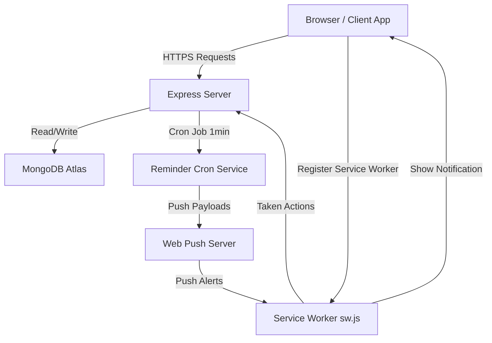

# 💊 MedRemind — MERN Medicine Scheduling & Notification System

MedRemind is a premium, real-world, clinical-grade medication adherence and tracker web application built on the MERN stack. It features custom reminders, automated background cron scheduling, caregiver relationship monitoring, browser push notifications, interactive analytics charts, and comprehensive administrative auditing.

---

## Architecture Overview

The system is structured as a highly decoupled client-server architecture:



### 1. Frontend Client (React)
- **Framework & Router:** React 19 client routing via `react-router-dom`.
- **State Management:** Lifted unified state at the `Dashboard` level to prevent duplicate network calls, ensuring single-fetch page rendering.
- **Optimistic UI Engine:** Instant visual feedback (Taken, Delete, Snooze) backed by background network synchronization and automatic state rollback on server failures.
- **Service Worker (`sw.js`):** Receives background push notifications via the Web Push API even when the application tab is closed.
- **API Interceptor:** Global Axios instance (`api.js`) automatically attaches JWT headers and handles session expiration redirecting.

### 2. Backend Server (Express & Mongoose REST API)
- **Server Platform:** Express 5.x on Node.js.
- **Database Engine:** MongoDB with schemas defined using Mongoose (User, Medicine, DoseLog, AuditLog, MedDatabase).
- **Hardened Cron Scheduler (`node-cron`):** Runs every minute with try-catch loop isolation so malformed user data or single database errors do not abort reminders for other users.
- **Push Service (`web-push`):** Uses VAPID key pair authentication to deliver payloads to the client service worker.
- **Security & Rate Limiting:** Specific endpoint rate limiting (`rateLimitMiddleware.js`) applied exclusively to registration and login POST actions, protecting system APIs without locking down authenticated profile management.

---

## 📁 Project Directory Structure

```
medremind-mern/
├── backend/
│   ├── config/              # MongoDB connection setup
│   ├── controllers/         # Request handling logic (auth, medicines, admin panel)
│   ├── middleware/          # JWT verification & endpoint rate-limiter
│   ├── models/              # Mongoose schemas (User, Medicine, DoseLog, AuditLog, MedDatabase)
│   ├── routes/              # Express endpoint routers
│   ├── services/            # Push notification delivery & cron reminder system
│   ├── server.js            # Main backend entry point
│   ├── .env.example         # Template for environment settings
│   └── package.json         # Backend node dependencies
└── frontend/
    ├── public/              # Index.html, manifest, icons, and sw.js
    └── src/
        ├── components/      # UI components (DailyProgress, MedicineList, Navbar)
        ├── pages/           # Application views (Dashboard, Login, Register, Profile, Admin)
        ├── services/        # Axios API configuration & Service Worker registration
        ├── styles/          # Global theme and component styles
        ├── App.js           # Main routing entry point
        └── index.js         # React root initialization
```

---

## 🗄️ Database Schemas & Models

### 1. User (`User.js`)
Stores authentication data, push subscriptions, and gamification metrics (streaks):
- `name` (String, Required)
- `email` (String, Required, Unique, Lowercase)
- `password` (String, Required, Hashed)
- `role` (String: `"user"` | `"admin"`, Default: `"user"`)
- `pushSubscription` (Object containing `endpoint`, `keys.p256dh`, and `keys.auth`)
- `streak` / `longestStreak` (Number)
- `maxMissedThreshold` (Number, Default: `3`)

### 2. Medicine (`Medicine.js`)
Defines scheduled medications:
- `userId` (ObjectId pointing to `User`, Required)
- `name` / `dosage` (String, Required)
- `times` (Array of Strings [HH:MM], Required)
- `timePeriods` (Array of Strings)
- `frequency` (String, e.g., `"once"`, `"twice"`, `"thrice"`, `"four"`)
- `startDate` / `endDate` (String)
- `taken` (Boolean, Default: `false`)
- `confirmationPending` (Boolean, Default: `false` — used by Cron/Service Worker notifications)
- `stock` / `refillAt` (Number)
- `refillNotified` (Boolean)
- `snoozedUntil` (Date)
- `snoozeCount` (Number)

### 3. DoseLog (`DoseLog.js`)
Persistently records taken or missed doses for auditing and analytics:
- `userId` / `medicineId` (ObjectIds)
- `medicineName` / `dosage` (String)
- `date` (String, YYYY-MM-DD)
- `scheduledTime` (String, HH:MM)
- `status` (String: `"taken"` | `"missed"`)
- `takenAt` (Date)

---

## Setup and Configuration

### Prerequisites
- Node.js 18+ installed.
- MongoDB instance (local or Atlas cloud connection).

### 1. Environment Configuration
Create a `.env` file in the `backend/` directory:
```env
PORT=5000
NODE_ENV=development
TZ=Asia/Kolkata
MONGO_URI=your_mongodb_connection_uri
JWT_SECRET=your_jwt_secret_phrase
ALLOWED_ORIGINS=http://localhost:3000

# VAPID Keys (for push notifications)
VAPID_PUBLIC_KEY=your_vapid_public_key
VAPID_PRIVATE_KEY=your_vapid_private_key
VAPID_EMAIL=mailto:your_email@example.com
```

> [!TIP]
> You can generate VAPID keys using Node `web-push` CLI:
> `npx web-push generate-vapid-keys`

### 2. Server Installation & Execution
```bash
# Install backend packages
cd backend
npm install

# Start backend development server (with nodemon)
npm start
```

### 3. Client Installation & Execution
```bash
# Install frontend packages
cd frontend
npm install

# Start development client server
npm start
```

---

## Administrative Setup

To access the administrative dashboards at `/admin`, your user account must have `role: "admin"`. You can elevate your user account using the provided CLI tool:

```bash
cd backend
node scripts/makeAdmin.js your_email@example.com
```

---

## Core API Endpoints

### Authentication
- `POST /api/auth/register` - Create new user account (rate-limited).
- `POST /api/auth/login` - Authenticate and return JWT token (rate-limited).
- `GET /api/auth/profile` - Fetch authenticated user info and dashboard statistics.
- `PUT /api/auth/profile` - Update display name or password.
- `DELETE /api/auth/account` - Permanently delete account and cascade delete all owned medicines/logs.

### Medication Management
- `POST /api/medicine/add` - Add a new medication.
- `GET /api/medicine` - Retrieve user's medications (checks and triggers daily reset on date change).
- `GET /api/medicine/reports` - Fetch analytics for Adherence rings and progress charts.
- `GET /api/medicine/logs` - Retrieve logs of past doses (taken or missed).
- `PATCH /api/medicine/taken/:id` - Mark a medicine dose as taken.
- `PATCH /api/medicine/snooze/:id` - Snooze medication notification.
- `PATCH /api/medicine/stock/:id` - Update inventory count.
- `DELETE /api/medicine/:id` - Delete medicine schedule.

---

## Optimizations & Bug Fixes Done

1. **Auth Endpoint Separation:** Fixed rate limiting blocks by moving the limit from the entire `/api/auth` mount route to only `/login` and `/register` endpoints. Authenticated profile edits no longer lock out active users.
2. **Hardened Cron Loop:** Added internal `try/catch` wrappers within the cron loops. A database error or parsing failure in one user's medicine schedule will no longer abort notifications for all other users.
3. **Non-Blocking Delivery:** Removed blocking `await` calls on push notification broadcasts. Notifications are fired asynchronously, preventing connection latency/timeouts from stalling the reminder queue.
4. **State Lifting & Performance:** Lifted `medicines` state to the dashboard. The application now performs exactly **one** API request on page load and distributes data to child components, resolving visual stutter and excessive network request volume.
5. **Optimistic UI Engine:** Applied optimistic updates to the Schedule and Progress rings, making actions feel instantaneous and loading times transparent.
6. **Email & Username Login Flexibility:** Added client-side email format validation during registration. Integrated case-insensitive, dual-method authentication allowing users to log in using either their registered email address or display name (username).
7. **Vertical Dashboard Hierarchy:** Re-engineered the main dashboard layout to stack vertically. The Daily Progress card is placed centered at the top for clear visual focus, followed by the Next Dose Preview banner, the schedule list, and Quick Actions grouped cleanly inside a white container card.
8. **Robust Profile Page Fixes:** Resolved a critical initialization crash in the profile page by adding safety checks for data loading. Redesigned the entire profile and reports views to replace green inline styling with premium design system variables.
9. **Visual Styling Refinements:** Changed background tokens to a slate-white tone (`#f4f6f9`), creating premium contrast against cards. Removed debugging notification buttons and browser warning alerts for a clean, real-world product look.
10. **Resolved generic `.auth-form button` style clash:** Excluded the password eye-toggle button from standard large form button styles to prevent overlapping layouts on auth forms.
11. **Resolved generic `.navbar button` style clash:** Prevented padding adjustments from distorting the size and position of notification bell icons.
12. **Fixed `updateStock` Controller crash:** Fixed a runtime ReferenceError by querying the medicine document before performing stock threshold checks.
13. **Fixed `deleteAccount` parser crash:** Added fallback structures to prevent crashes when incoming DELETE requests lack structured body payloads.
